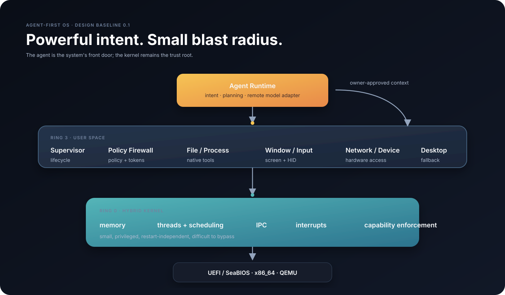
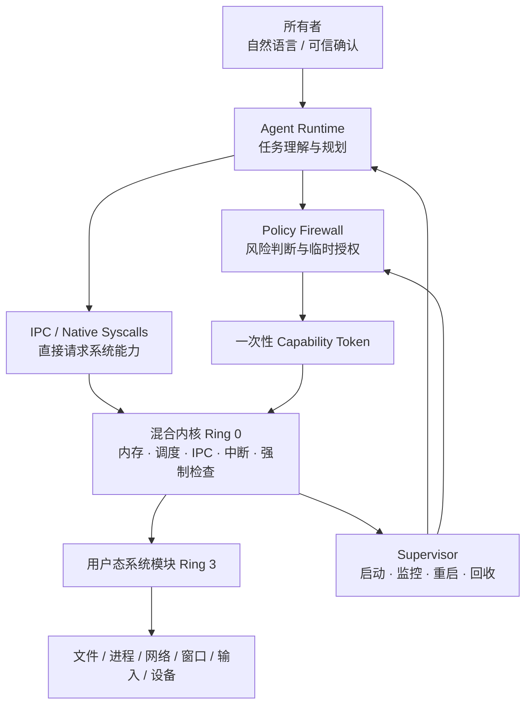
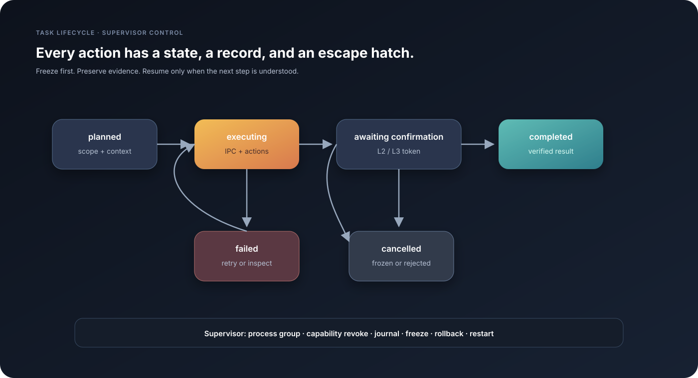
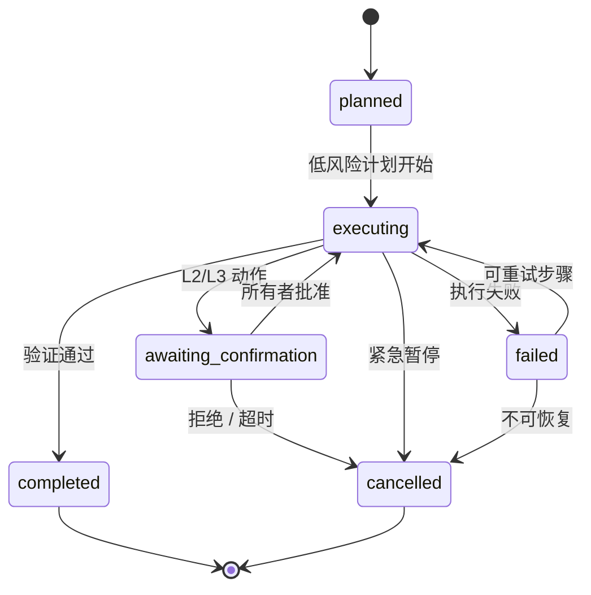

# Agent-First OS

## 仓库导航

这是 Agent-First OS 的公开开发仓库。仓库分成两个相互衔接、职责不同的区域：

```text
learning/   学习主线：课程、实验、阶段代码、证据和复盘
product/    产品主线：可合并的 OS 代码、系统模块、Agent Runtime 和发布成果
```

### `learning/` 学习区

- `curriculum/`：课程总纲、资源清单和阶段验收协议；
- `lessons/`：每一课的目标、讲解、预测题和练习；
- `projects/`：按阶段保存的独立实验和可运行小产物；
- `evidence/`：构建命令、QEMU 参数、串口日志、GDB/ELF/页表输出、故障注入结果；
- `notes/`：概念笔记、设计复盘和未验证事项。

学习区的代码允许为了教学而拆小、重写和故意注入故障，不直接等同于产品代码。

### `product/` 产品区

- `kernel/`：混合内核及其启动、内存、调度、IPC、capability 等实现；
- `userland/`：原生用户态运行时、libc、shell 和系统工具；
- `services/`：Supervisor、文件、进程、网络、窗口、输入和设备模块；
- `agent-runtime/`：远程模型适配、任务状态、上下文授权和执行逻辑；
- `tools/`：构建、镜像、调试和发布工具；
- `tests/`：跨模块的功能、安全、故障和恢复测试；
- `docs/`：产品设计、架构图、决策记录和发布说明。

产品区只接收经过独立验证、具备运行证据和清晰变更说明的成果。学习区的实验完成后，经过评审才会迁移到产品区。

课程入口：[learning/curriculum/CURRICULUM.md](learning/curriculum/CURRICULUM.md)　·　产品设计书：[product/docs/DESIGN_BOOK.md](product/docs/DESIGN_BOOK.md)

---

## 设计哲学与系统架构 · Design Book v0.1

> 一个面向现代 x86_64 PC 的操作系统：让用户表达目标，让系统负责理解、执行、验证与恢复。

**状态：设计基线**　**目标平台：UEFI x86_64 PC**　**开发基线：QEMU + UEFI/OVMF**

这不是一个“把聊天机器人装进操作系统”的方案。它试图重新定义操作系统的主要交互方式：
agent 是系统的主要入口，但系统的权力仍然由本地内核、策略和所有者掌握。

---

## 一句话愿景

> **把“我想完成什么”变成操作系统的第一类输入，把“系统如何安全地完成它”变成操作系统的核心能力。**

用户可以说：

> “整理下载目录，把今天收到的资料分类，打开浏览器继续刚才的研究。”

系统不只是生成一段文字，而是观察被授权的窗口，规划一组可验证的动作，调用本地能力，检查结果，并在需要时请求所有者确认。

---

## 我们相信什么

### 1. Agent 是交互层，不是信任根

模型可以理解意图、制定计划和选择动作，但模型本身不是安全边界。远程模型会出错、会被提示注入，也可能暂时不可用。系统必须在没有模型、模型失控或 agent 崩溃时继续运行。

### 2. 权力可以很大，故障范围必须很小

agent 可以获得广泛的管理员 capability，控制文件、进程、窗口、键盘、鼠标、网络和设备；但它仍运行在用户态，不能直接执行内核特权指令或修改安全根规则。

### 3. 直接不等于无约束

agent 可以直接调用系统接口，不强制经过一个用户态 Tool Broker。真正不可绕过的检查位于内核或独立的安全监控层：它验证 capability、资源、授权 token 和硬性安全规则。

### 4. 先观察，再行动；行动后必须验证

一个动作只有在目标窗口、目标资源和预期结果都明确时才值得执行。输入事件发出后，系统要确认窗口没有切错、文本确实写入、文件确实保存。

### 5. 可撤销是默认体验

文件移动、配置修改、用户态模块更新等本地操作默认写入事务日志，支持恢复到任务前状态。发送邮件、上传文件和现实设备动作等外部副作用不能假装可回滚，必须单独提高风险等级。

### 6. 离线仍然是一个完整系统

系统启动、桌面、文件、进程、输入、维护终端和恢复机制不依赖远程模型。联网时，远端模型增强推理能力；断网时，系统退回正常桌面和维护模式。

### 7. 复杂性应停留在模块内部

内核只提供少量、稳定、可验证的原语。文件、网络、窗口、输入、语义目录和 agent 都通过用户态模块实现，以便替换、重启和演进。

---

## 这是什么，和普通 Agent 软件有什么不同

普通 agent 通常是运行在已有操作系统之上的应用。Agent-First OS 把 agent 变成系统级交互层：

| 普通 Agent 软件 | Agent-First OS |
|---|---|
| 依赖宿主系统提供能力 | 自己定义能力、权限和模块接口 |
| 通过脚本或自动化库间接控制电脑 | 输入、窗口、进程、文件和网络都是系统能力 |
| agent 挂掉，应用退出即可 | agent 可重启，系统核心、桌面和维护模式继续运行 |
| 模型通常决定下一步怎么做 | 本地内核和策略决定什么操作最终能做 |
| 全部数据通常由应用自行处理 | 上下文默认按当前任务窗口和文件授权 |
| 更新通常是应用升级 | 系统模块有签名、健康检查、回滚和维护模式 |

产品的创新点不在于把模型放进 Ring 0，而在于重做系统的能力接口、授权机制、任务生命周期和用户体验。

---

## 总体架构





### 内核态：少而硬

第一版内核只承担必须由特权级保证的事情：

- 启动与 CPU 初始化；
- 地址空间、页表和虚拟内存；
- 线程、调度和进程生命周期；
- 系统调用入口；
- 中断分发；
- 同步 IPC 和 capability 传递；
- 共享内存映射与撤销；
- 用户指针、资源边界和硬性安全规则检查；
- 第一版启动与调试所需的最小硬件支持。

第一版采用 Ring 0 + Ring 3，不使用 Ring 1 和 Ring 2。混合内核描述的是模块放置方式，不是把所有 CPU Ring 都用起来。

### 用户态：复杂而可替换

用户态模块都可以被监督、替换和重启：

| 模块 | 职责 |
|---|---|
| `Supervisor` | 第一个用户态进程；启动依赖、监控健康、冻结/回收任务、重启模块 |
| `Policy Firewall` | 判断风险、管理规则、签发一次性 token；不能被 agent 修改 |
| `Agent Runtime` | 管理会话、上下文、远程模型连接、计划和执行结果 |
| `File / Process / Network Service` | 提供文件、进程和网络能力 |
| `Window / Input Service` | 管理桌面、窗口、屏幕、键盘和鼠标 |
| `Semantic Registry` | 注册可调用工具的描述、schema、权限和版本 |
| `Model Adapter` | 连接远程模型；未来可替换为本地模型 |
| `Desktop / Terminal` | agent 不可用时的独立操作和恢复入口 |

---

## 启动与平台策略

产品面向现代 PC，但教学启动链和产品启动链分开：

```text
教学路径：SeaBIOS → 自写 Stage 1/Stage 2 → 32 位 → 64 位 → C 内核
产品路径：UEFI/OVMF → UEFI 启动器 → ELF64 内核
```

两条路径都交给同一个内核接口：

```c
kernel_entry(const BootInfo *boot_info);
```

`BootInfo` 是版本化交接协议，至少描述：内存布局、ACPI 信息、GOP 帧缓冲、启动参数、已加载模块和协议版本。内核镜像采用 ELF64，而不是没有段信息的裸二进制。

产品基线是 UEFI、ACPI、GOP 和 PCIe。开发先在 QEMU/OVMF 中支持 virtio-block、virtio-net、虚拟键鼠和串口调试，再扩展到真实 PC 的 NVMe、USB HID、显卡、Wi‑Fi 和电源管理。

---

## 权限与信任模型

### Agent 的权限很大，但不是 Ring 0

agent 可以被授予广泛 capability：

```text
filesystem.read / filesystem.write
process.start / process.stop / process.inspect
window.observe / window.control
keyboard.inject / mouse.inject
network.connect
device.use
```

capability 是由内核生成的不可伪造句柄，绑定对象和权限位，支持转移、限制和撤销。agent 不能通过猜测整数、修改自身配置或启动子 shell 来伪造新能力。

### 风险分级

| 等级 | 典型操作 | 默认行为 |
|---|---|---|
| L0 | 查询状态、读取信息、搜索文件 | 自动执行 |
| L1 | 可撤销的本地修改 | 自动执行、记录日志 |
| L2 | 大范围删除、安装软件、修改网络 | 确认或更高授权 |
| L3 | 修改启动链、内核、策略、密钥、发送敏感数据 | 强制确认或维护模式 |

高风险授权采用一次性 token：策略层签发，内核验证；agent 不能自己生成、延长或伪造 token。确认必须来自 agent 无法模拟的可信输入通道。

### 键盘和鼠标控制

键盘、鼠标和屏幕是本地系统能力，不是模型的特殊特权。agent 可以：

- 观察当前任务窗口的 UI 树和必要截图；
- 直接调用窗口、输入和进程接口；
- 在必要时注入键盘、鼠标和触控事件；
- 在每一步之后读取结果并验证状态。

默认只授予当前任务明确选定的窗口。需要跨窗口时，agent 必须请求扩大窗口范围。

---

## 任务生命周期





每个任务都由 Supervisor 建立独立进程组。agent 启动的浏览器、终端、脚本和 worker 都属于该任务树。

紧急暂停时：

```text
全局快捷键 / 专用安全按键
  → 撤销任务 capability
  → 冻结整个进程组
  → 取消未完成 IPC 和 token
  → 停止输入注入
  → 保留日志，等待恢复或终止
```

任务日志保存执行前状态、动作 ID、授权 token、结果、可重试性和可撤销性。agent 崩溃后，Supervisor 可以从断点继续、回滚或取消；不可逆外部动作禁止自动重放。

---

## 远程模型与隐私

模型推理默认在远端，本地不要求部署大模型。远程模型是**不可信的规划者**，本地系统是**可信的执行者**：

```text
当前任务窗口 / 用户选择的文件
  → 本地 Context Collector
  → 脱敏与授权检查
  → 远程模型
  → 结构化动作计划
  → 本地 capability 与策略验证
  → 本地执行与结果验证
```

离线时，系统不等待云端模型启动，也不把远程连接当成内核依赖。未来有条件部署本地模型时，只替换 `Model Adapter`，不重写内核、权限、工具和任务接口。

---

## 原生程序与生态

第一版先建立自己的原生程序模型：静态 ELF64 用户程序、自定义 capability syscall ABI 和用户态系统模块。

未来的完整 OS 形态包括：

```text
原生 syscall ABI
  → 原生 libc / runtime
  → 文件、网络、进程、窗口和输入服务
  → Shell、桌面、包管理器和应用生态
  → 用户态 POSIX 兼容层
```

Linux/Windows 兼容不是第一版目标。兼容层未来作为用户态适配器加入，不污染内核的原生接口。

---

## 设计基线

| 领域 | 已确定方案 |
|---|---|
| 产品形态 | 可独立启动的 agent-first 操作系统 |
| 目标硬件 | 现代 x86_64 PC |
| 产品启动 | UEFI 优先 |
| 教学启动 | SeaBIOS，自己编写完整启动链 |
| 开发环境 | QEMU + UEFI/OVMF + virtio |
| 内核形态 | 混合内核 |
| 权限级别 | Ring 0 + Ring 3 |
| 内核语言 | C + x86_64 汇编 |
| 启动交接 | ELF64 + 版本化 BootInfo |
| CPU 范围 | 先单核，后续加入 SMP |
| 虚拟内存 | 先恒等映射，之后高半内核 |
| IPC | 同步小消息 + capability 共享内存 |
| 权限 | 不可伪造、可撤销 capability |
| agent | 用户态、高权限、可直接调用系统接口 |
| 安全 | 内核强制规则 + L0–L3 + 一次性 token |
| 模型 | 远端优先，未来可替换为本地模型 |
| 上下文 | 当前任务窗口和明确授权文件 |
| 应用生态 | 先原生 ABI，后续用户态 POSIX 兼容 |

---

## 第一版明确不做什么

- 不把大模型或 agent 放进 Ring 0；
- 不让 agent 修改内核、安全策略根或启动器；
- 不把所有系统能力暴露成任意 shell；
- 不默认读取整个桌面和所有用户文件；
- 不在第一版支持所有真实 PC 驱动；
- 不在第一版追求 Linux/Windows 应用兼容；
- 不把多用户、完整本地模型和全硬件生态混入最小内核里；
- 不把教学启动链和最终产品启动路径混为一件事。

这些不是永久限制，而是为了让第一版仍然能被理解、验证和恢复。

---

## 词汇表

| 术语 | 在本项目中的含义 |
|---|---|
| Agent Runtime | 运行 agent 会话、计划、上下文和模型适配器的用户态模块 |
| Capability | 内核签发、不可伪造且可撤销的资源权限句柄 |
| Policy Firewall | 判断风险、管理规则、签发临时授权的高信任模块 |
| Supervisor | 第一个用户态进程，负责模块生命周期和任务恢复 |
| Semantic Registry | 面向系统工具的 schema、权限、风险和版本注册表 |
| Tool | 有固定 ID、参数和权限声明的系统能力，不是任意文本命令 |
| Trusted Input | agent 无法伪造的所有者确认通道 |
| Maintenance Mode | 修改内核、启动器、安全根规则时使用的受控模式 |

---

## 文档状态

这份文档记录的是当前设计共识，不代表已经完成实现，也不宣称已经在真实 PC 上运行。实现开始后，架构变更应通过单独的决策记录更新本文件。

相关图示：

- [总体架构图](product/docs/assets/architecture-overview.svg)
- [信任与权限边界图](product/docs/assets/trust-boundary.svg)
- [任务生命周期图](product/docs/assets/task-lifecycle.svg)
